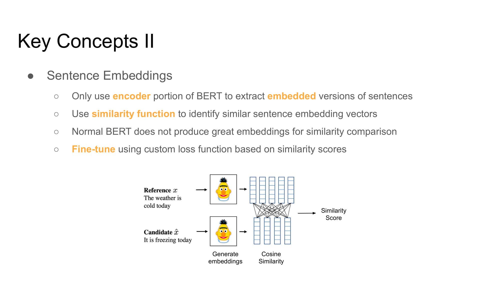

# Covid Literature Search

A search engine built using PyTorch (HuggingFace), React.js and Flask. Based on the COVID-19 Open Research Dataset (CORD-19) by the Allen Institute for AI, with over 29,000 scholarly articles and 13,000+ in full text. (https://allenai.org/)

## Directory
      .
      ├── README.md
      ├── prepare_embeddings.ipynb        # The secret sauce
      ├── etc/                            # Archived notebooks and unused code
      ├── doc/
            └── slides.pdf                # Presentation material
      └── react-app/                      # React frontend
            ├── flask-api                 # Flask backend; store CovidBERT model here
            └── ...

## How it works in one slide:

Search results are generated using CovidBERT to create sentence embeddings. We find the best results based on how "similar" user inputs are with journals from the Allen-AI CORD-19 dataset.

